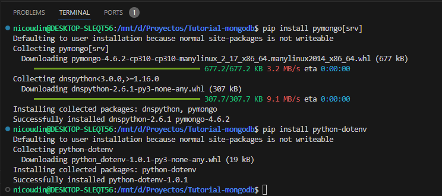

# Introducción a MongoDB

1. [Intalacion MongoDB](#1.-instalacion-mongodb)
    - [Instalacion CLI](#.-instalacion-cli)
    - [Instalacion ATLAS](#.-instalacion-atlas)
    - [Loging a MongoDB](#.-loging-a-mongodb)
    - [Teoria](#.-teoria)
2. [Comandos CRUD](#2.-comandos-crud)
    - [Seleccionar un BD y Coleccion](#.-seleccionar-una-bd-y-coleccion)
    - [Insert](#.-insert)
    - [Select](#.-select)
    - [Updates](#.-updates)
    - [Delete](#.-delete)
3. [Relaciones en MongoDB](#3.-relaciones-en-mongodb)
    - [Embedings](#.-embedings)
    - [Foreign Keys](#.-foreign-key)
4. [Data Modeling](#4.-data-modeling)
    - [Schema Validation](#.-schema-validation)
    - [One-to-One](#.-one-to-one)
    - [One-to-Many](#.-one-to-many)
5. [Advance Querys](#5.-advance-querys)
    - [Regular Expression](#.-regular-expression)
    - [Joins](#.-joins)
    - [Count](#.-count)
    - [Restricciones](#.-restricciones)


# 1. Instalacion MongoDB

Para poder trabajar con __python__ y __mongoDB__ necesitamos instalar dos librerias.
+ pymongo[srv]
+ python-dotenv

```
pip install pymongo[srv]
pip install python-dotenv
```



## Instalacion CLI

Por defecto el puerto de la instalacion de MongoDB es mongodb://localhost:27017

## Instalacion Atlas

## Loging a mongodb

Para logearnos a mongoDB desde VSCODE usamos el siguiente script de python

```python
from dotenv import load_dotenv, find_dotenv
import os
import pprint
from pymongo import MongoClient

load_dotenv(find_dotenv())
PUERTO = os.environ.get('MONGO_PORT')

connection_string = f"mongodb://localhost:{PUERTO}"
client = MongoClient(connection_string)

print(client)
```

Donde __MONGO_PORT__ es una variable de entorno definida en el archivo __.env__ que debe estar en el mismo directorio que el script __main.py__

## Teoria

```
Es una base de datos No-SQL que almacena los datos en JSON FORMAT.
Permite hacer modificaciones a la estructura o esquema de los datos.
Son mas escalables.
```

+ ¿Cómo es la estructura de MOngoDB?

MongoDB está formado por _bases de datos__ las cuales tienen __colecciones__ y estás están formadas por __documentos__
Los __documentos__ son los que almacenan los datos que son categorizados en __colecciones__ y estas forman las __bases de datos__

Por ejemplo.

Si tenemos un sistema de librerias un ejemplo de implementacion seria:

BD

* Libreria

Colecciones: 

* Book
* Person
* Rental

y estas coleeciones tendrian los documentos JSON

Ejemplo de __book colection__

```json
{
    "author":"Nicolas Leali",
    "Title":"Introducción a la informatica",
    "Publish_date": "2022-01-01",
    "copies": 100

}
```

La informacion en una coleccion se guarda en formato __key:value__ similar a un diccionario de Python. 
Internamente MongoDB usa un formato similar a JSON llamado BSON.

# 2. Comandos CRUD

## Seleccionar una BD y coleccion

Para trabajar una BD y una coleccion espeficica usamos el siguiente script

```python
miDB = client.get_database('miBD')
collecion = miDB.__nombreColeccion__
```

Si necesitamos listas las colecciones disponibles hacemos

```python
miDB.list_collection_names()
```

__IMPORTANTE__

Si usamos __dot notation__ y hacemos referencia a una BD que no existel mongoDb la crea automaticamente.

```python
producion = client.produccion
mi_coleccion_produccion = produccion.mi_coleccion
```

## Insert

Insertamos un documento dentro de una coleccion.

```python
def insert_test_doc():
    collection = miDB.alumnos
    test_doc = {
        "name":"Nicolas",
        "type":"Test"
    }
    insert_id = collection.insert_one(test_doc).inserted_id
    print(insert_id)

insert_test_doc()
```

Usamos __.inserted_id__ para devolver el id unico que genera __mongoDB__ para identificar un documento.

## Bulk Insert

Si tenemos muchos documentos para insertar lo mejor es usar __insert_many()__

```python
def create_document():
    nombre = ['Nicolas', 'Martin', 'Alejandro', 'Patricio']
    edad = [36,35,35,36]
    apellido = ['Leali','Caronte','Francolino','Perez']

    array = []
    for nombre, edad, apellido in zip(nombre, edad, apellido):
        doc = {'nombre':nombre, 'apellido':apellido, 'edad':edad}
        array.append(doc)
    
    collection.insert_many(array)
```

## Select

```
Existen varias formas de obtener documentos, una de ellas es usando .find()
Donde de find lo que se pasa es un objeto de consulta similar a una condición de SQL.
```

### select all 

```python
printer = pprint.PrettyPrinter()

def find_all_people():
    collection = miDB.alumnos
    people = collection.find()
    
    for person in people:
        printer.pprint(person)
    
find_all_people()
```

### select specific doc

Para obtener un documento especifico debemos usar __find_one()__ y pasarle el campo o __key__ con el valor __value__ que queremos.
Esto nos devuelve el primer documento que cumple con el criterio __key__:__val__ 

```python
printer = pprint.PrettyPrinter()
def find_nicolas():
    collection = miDB.alumnos
    nicolas = collection.find_one({'nombre':'Nicolas', 'edad':36})
    printer.pprint(nicolas)
    
find_nicolas()
```

Tambien podemos usar mas de una __key__ 

```json
{'nombre':'nicolas', 'edad':36}
```

### Select Count()

Obtenemos la cantidad de documentos que cumplen con un criterio.
Para obtener el total de documentos hacemos:

```python
def count_numero_of_people():
    collection = miDB.alumnos
    total = collection.count_documents(filter={})
    print(total)

count_numero_of_people()
```

### Select by id

Sabemos que MongoDB almacena un ID. Para poder buscar por este ID hay que hacer una transformacion.

```python
printer = pprint.PrettyPrinter()

def get_person_by_id(id_person):
    collection = miDB.alumnos
    from bson.objectid import ObjectId

    _id = ObjectId(id_person)

    person = collection.find_one({'_id':_id})
    printer.pprint(person)
    
get_person_by_id('65dc9ec083484190e2657088')   
```

### Select by range

Para seleccionar con rangos debemos indicar explicitamente en el __query object__ usando la notación de mongoDB y los operadores, por ejemplo:

|operador|descripcion|
|--------|-----------|
|$and|Especificar que todas las condiciones deben ser true|
|$gte|Especifica que un valor sea mayor o igual|
|$lte|Especifica que un valor sea menor o igual|

_Ejemplo de notacion_

```json
query = 
    {"$and":[
            {"age":{"$gte":min_age}},
            {"age":{"$lte":max_age}}
            ]
    }
```

```python
printer = pprint.PrettyPrinter()
def get_people_by_age(min_age, max_age):
    collection = miDB.alumnos
    query = {
            "$and":
            [
                {"edad":{"$gte":min_age}},
                {"edad":{"$lte":max_age}}
            ]
        }
    
    

    people = collection.find(query).sort("edad")
    for person in people:
        printer.pprint(person)

get_people_by_age(34,36)
```

__IMPORTANTE__ notar que en este ejemplo no usamos __find_one()__ usamos __find__ porque queremos encontrar todos los registros

### Proyectar columnas

No siempre queremos ver todas las columnas, solo algunas. Podemos limitarlas.

```python
printer = pprint.PrettyPrinter()

def show_only_columns():
    columnas = {'_id':0, 'nombre':1, 'Edad': 1}
    collection = miDB.alumnos

    personas = collection.find({}, columnas) 

    for persona in personas:
        printer.pprint(personas)

show_only_columns()
```

Si ponemos __key:0__ indicamos que no queremos ver la columna
Si ponemos __key:1__ indicamos que si queres ver la columna.


## Updates

```
Hay muchas formas de ejecutar updates. La mas común es usando una query object como hacemos en SELECT
```

|operadores|description|
|----------|-----------|
|$set|Lo usamos para setear un nuevo campo, si el campo existe lo sobreescribe|
|$inc|Se usa para incrementar en valor numerico|
|$rename|Le cambiamos el nombre a un campo, no a la clave|
|$unset|Elminamos un campo del documento|

Cuando hacemos un update debemos especificar el documento que queremos cambiar.

```python
printer = pprint.PrettyPrinter()

def update_persona_by_id(id_per):
    from bson.objectid import ObjectId

    collection = miDB.alumnos

    sql = {
        "$set":{"new_field":True},
        "$inc":{"edad":10},
        "$rename":{"apellido":"last_name"}
    }

    _id = ObjectId(id_per)

    collection.update_one({"_id":_id}, sql)

update_persona_by_id('65dc9ec083484190e2657089')
update_persona_by_id()
```

### Update - unset

```
Usamos $unset cuando queremos eliminar un campo de un documento
```

```python
printer = pprint.PrettyPrinter()

def update_persona_by_id(id_per):
    from bson.objectid import ObjectId

    _id = ObjectId(id_per)

    sql = {
        "$unset":{'new_field':''}
    }

    collection = miDB.alumnos

    collection.update_one({'_id':_id}, sql)

update_persona_by_id('65dc9ec083484190e2657089')
```

### Update - Replace

Lo usamos cuando queremos reemplazar un documento pero seguir usando el _id.

```python
printer = pprint.PrettyPrinter()
def update_replace_persona(id_per):
    from bson.objectid import ObjectId

    _id = ObjectId(id_per)

    doc = {
        'Nombre':'Alejandro',
        'Apellido':'Francolino y Aguero',
        'Edad':37
    }
    
    collection = miDB.alumnos

    collection.replace_one({'_id':_id}, doc)

update_replace_persona('65dc9ec083484190e2657089')    
```

## Delete

### Delete One

Usamos __delete_one()__ cuando queremos eleiminar todo un documento

```python
printer = pprinter.PrettyPrinter()

def delete_by_id(per_id):
    from bson.objectid import ObjectId
    
    _id = ObjectId(per_id)
    
    collection = miDB.alumnos
    
    collection.delete_one({'_id':_id})
    
delete_by_id('65dc9ec083484190e2657089')
```

### Delete Many

Usamos __.delete_many()__ si necesitamos eliminar varios registros de una vez.

```python
printer = pprint.PrettyPrinter()
def delete_all():
    collection = miDB.alumnos

    collections.delete_many({})

#delete_all()
```

# 3. Relaciones en MongoDB

Hay varias formas de crear relaciones en MongoDB, las dos proncipales son __embedings__ y __Foreign Keys__ cada una tiene sus pros y contras.

## Embedings

```
Su finalidad es tener una única coleccion que relacione dos entidades.
```
Por ejemplo tenemos.

```json
address = {
    "_id": "456354645",
    "street": "calle 01",
    "numero": 4567,
    "city": "CABA",
    "zip": 5643
}

persona = {
    "_id":"e6574847u5756h4730j38"
    "nombre":"Nicolas",
    "apellido":"mi apellido",
    "edad":35
}
```

Lo que podemos hacer es agregar __address__ a persona como una nueva __key__:[direccciones]
El problema es si tenemos varias personas que comparten una misma direccion, tendremos que hacer __embeding__ en cada una de ellas y si hay que modificar la direccion tambien habrá que hacer __n__ cambios.

```json
persona = {
    "_id":"e6574847u5756h4730j38"
    "nombre":"Nicolas",
    "apellido":"mi apellido",
    "edad":35,
    "address" : [{
                    "_id": "456354645",
                    "street": "calle 01",
                    "numero": 4567,
                    "city": "CABA",
                    "zip": 5643
                    }]
}
```

Ejemplo de Embed

```python

mi_dict = {
                "street": "calle 01",
                "numero": 4567,
                "city": "CABA",
                "zip": 5643
            }

def add_address_embed(id_pers, address):
    from bson.objectid import ObjectId

    _id = ObjectId(id_pers)

    collection = miDB.alumnos

    SQL = {
            "$addToSet": {'addresses':address}
            }

    collection.update_one({"_id":_id}, SQL)

add_address_embed('65dc9ec083484190e265708a', mi_dict)
```

En este ejemplo que que hicimos fué agregar un nuevo __array__ al documento llamdo __addresses__ con la finalidad de poder agregar nuevas direcciones en un futuro.
SI hubieramos hecho __$set__ hubieramos agregado una nueva __key:val__ que no aceptará agregar nuevos valores.

## Foreign Key

```
La idea es tener colleciones separadas pero una de ellas tiene una relacion de FK hacia otra.
```

Por ejemplo tenemos.

```json
address = {
    "_id": "456354645",
    "street": "calle 01",
    "numero": 4567,
    "city": "CABA",
    "zip": 5643,
    "owner_id": "e6574847u5756h4730j38"
}

persona = {
    "_id":"e6574847u5756h4730j38"
    "nombre":"Nicolas",
    "apellido":"mi apellido",
    "edad":35
}
```

Dentro de la collecion __address__ agregamos una nueva __key__ que apunta a la coleccion persona con la que queremos vincularla. por ejemplo creando la key __owner_id__

Ejemplo de implementación.

__importante__ para este ejemplo vamos a crear la collection __addresses__

```python

address = {
                "street": "calle 01",
                "numero": 4567,
                "city": "CABA",
                "zip": 5643
            }

def add_address_relation(per_id, address):
    from bson.objectid import ObjectId

    _id = ObjectId(per_id)

    address = address.copy()
    address["owner_id"] = _id

    address_collection = miDB.address
    address_collection.insert_one(address)

add_address_relation('65dc9ec083484190e2657087', address)
```

En este ejemplo pasamos un diccionario con el JSON que queremos vincular al documento con id __65dc9ec083484190e2657087__.
Para esto, notar que hacemos un hardcopy de __address__ para no modificar el valor de la variable.
Luego creamos la coleccion __address__, la misma se crea de forma automatica porque no existe.
Y a la variable __address__ le pasamos tambien el __id__ que queremos vincular.

# 4. Data Modeling

```
Para esta parte vamos a desarrollar un modelo de datos donde tendremos dos colecciones. Una de LIbros y otra de Autores, la idea es poder ver la cantidad de libros de cada Autor e implementar nuevas funciones.
Tambien usar la Validacion de esquema para crear una relacion de integridad mas fuerte al momento de insertar nuevos documentos.
```

## Schema Validation

Es una forma de crear una forma de estructura dentro la coleccion.
Nos permite definir tipo de datos, keys y si es obligatorio o no.

Existe fos formas de crear la validacion en las colecciones.
Una es al momento de crear la coleccion.

```python
 db.createCollection("autores", {
    validator:{
        "$jsonSchema":{
            "bsonType": "object",
            "required": ["name", "year", "major", "address"],
            "properties": {
                "name": {
                    "bsonType": "string",
                    "description": "must be a string and is required"
                },
                "year": {
                    "bsonType": "int",
                    "minimun": 2017,
                    "maximun": 3017,
                    "description": "must be an integer in [2017, 3017] and is required"
                },
                "major": {
                    "enum": ["math", "English", "Computer Sciences", "History", null],
                    "description": "can only be one of the enum values and is required"
                },
                "gpa": {
                    "bsonType": ["double"],
                    "description": "must be a double is the field exists"
                },
                "address":{
                    "bsonType": "object",
                    "required": ["city"],
                    "properties":{
                        "street":{
                            "bsonType": "string",
                            "description": "must be an integer if the field exists"
                        },
                        "city":{
                            "bsonType": "string",
                            "description": "must be string if the field exists"
                        }
                    }
                }

            }
        }
        }
    }
)
```

En este ejemplo todos los campos que estan especificados en __required__ son obligatorios, pero __gpa__ y __address__ no están, entonces son optativos, pero en caso de ser enviados __address__ tiene un formato definido.


Otra forma es primero crear el esquema en formato __json__ y luego se lo agregamos a una collection existente.

+ Ejemplo de __book validator__


```python
book_validator = {
    "$jsonSchema":{
        "bsonType":"object",
        "required":["title", "authors", "publish_date", "type", "copies"],
        "properties":{
            "title":{
                "bsonType": "string",
                "description": "must be a string and is required"
            },
            "authors":{
                "bsonType": "array",
                "items": {
                    "bsonType": "objectId",
                    "description": "must be an objectId and is required"
                }
            },
            "published_date": {
                "bsonType": "date",
                "description": "must be a date and is required"
            },
            "type": {
                "enum": ["Fiction", "Non-Fiction"],
                "description": "can only be one of the enum values and its required"
            },
            "copies": {
                "bsonType": "int",
                "minimum": 0,
                "description": "should be greather than 0 and is required"
            }

        }
    }
}
```

En este ejemplo __authors__ es del tipo __array__ asique los tipos de sus componentes deben ser especificados.
El campo Type, es un __enum__ asique se le indican los valores posibles.


Creamos una coleccion y le __agregamos el validador__.

```python
try:
    miDB.createCollection("Book")
except Exception as e:
    print(e)

miDB.command("collMod", "Book", validator=book_validator)
```

## One-to-One

Cuando tenemos una relacion que sabemos que es __one-to-one__ por ejemplo una dirección  que solo está asociada con una persona está bien usar __embeding__ 
Pero si tenemos una direccion que es compartida con mas de una persona y la misma puede ser modificada, es un gran consumo de recursos de almacenamiento y de mantenimiento. Ya que si la direccion tuviera una modificacion deberia ser modificada en N documentos.

Tambien podemos tener un __documento__ con mucha informacion que es __time consuming__ y quizás no siempre es necesaria. Para estos casos existe un enfoque llamado __subseting__ que permite seprar en colecciones lo que mas cosultados de lo que es consultado de forma infrecuent, generando una relacion del tipo __foreign key__

Un problema con este ultimo enfoque es que puede generar mas __joins__ de los que quisieramos.

## One-to-Many

Cuando tenemos este escenario es parecido a lo que deciamos antes, donde se repite mucho un dato o propiedad pero ocmo beneficio no tenemos que hacer muchos __join__.

Cuando tenemos un caso de __One-to-Many__ se intenta crear una relacion de __foreign Keys__ donde se divide una coleccion en dos o mas relacionadas por una __FK__

Tambien el enfoque de __subset__ es valido.


# 5. Advance Querys

## Regular Expression

1. Queremos obtener todos los libros que tienen la letra __A__


```python
books_containing_a = books_collection.find({"title":{"$regex":"a{1}"}})
```

Esta expresion indica que queremos bsucar lo que tenga al menos una A.

## Joins

Usamos __JOINS__ para unir dos o mas collections. Por ejemplo.

2. Queres vincular los autores con todos los libros que escribieron.

```
Para esto vamos a usar .aggregate que permite pasar un pipeline para encadenar acciones.
El JOINS lo usamos haciendo $lookup (left join).
```

```python
authors_and_books = author_collection.aggregate([{
    "$lookup":{
        "from": "book",
        "localField": "_id",
        "foreignField": "authors",
        "as": "books"
    }
}])
```

__from__ indica la otra coleccion contra la que queremos hacer el __left join__
__localField__ es el campo de la tabla de la izquiera para hacer el cruce
__foreignField__ es el campo de la tabla de la derecha

## Count

3. Queres encontrar la cantidad de libros que escribió cada Autor.

Para lograr esto el __pipeline__ primero debe vincular el autor con todos sus libros. #Lo hicimos en el punto dos#


Luego agregamos un nuevo campo __total_books__, para agregar este nuevo campo usamos el array __books__ que creamos en el __pipeline__ anterior.

```python
count_authors_and_books = authors_collecton.aggregate(
    [ # lista
    { # primer pipeline left-join
        "$lookup":{
            "from": "Book",
            "localField": "_id",
            "foreignField": "authors",
            "as": "books"
        }
    },
    { # segundo pipeline - count
        "$addFields":{
            "total_libros":{"$size":"$books"}
        }
    },
    { # tercer pipeline - muestra
        "$project":{
            "first_name":1, "last_name":1, "total_libros":1, "_id":0
        }
    }
])
```

__IMPORTANTE__ notar que en el segundo pipeline llamamos a la funcion __$size__ sobre lo que generamos en el __pipeline anterior__ __"as":"books"__
sobre ese array hacemos __$size__

## Restricciones

+ Queremos  mostrar los autores y sus libros pero solo aquellos autores que tienen entre 50 y 60 años.

```
Lo complicado de acá es que no tenemos un campo de edad, sino que tenemos la fecha de nacimiento.
```

```python
book_collection.aggregate(
    [ # Lista del pipeline
     { # pipeline 1 - lookup
      
        "$lookup":{
            "from": "Author",
            "localField": "authors",
            "foreignField": "_id",
            "as": "autores"
        }
         
     },
     { # pipeline 2 - set edad
      
      "$set":{
          "autores":{
              "$map":{
                  "input": "$autores",
                  "in": {
                      "age":{
                          "$dateDiff":{
                              "startDate": "$$this.date_of_birth",
                              "endDate": "$$NOW",
                              "unit": "year"
                          }
                      },
                      "first_name":"$$this.first_name",
                      "last_name": "$$this.last_name"
                  }
              }
          }
      }
          
         
     },
     
     { # piplene 3 - filtrar por cierta edad
      
      "$match": {
          "$and": [
              {"autores.age": {"$gte":18}},
              {"autores.age": {"$lte":100}}
          ]
      }
         
     },
     {# pipeline 4 - sort by age
      
      "$sort":{
          "age":1
            }
         
     }
]
    )
```

Una vez que tenemos el agrupado en el __pipeline 1__ para saber que autores tiene cada libro junto con los datos del autor vamos a calcular la edad de cada uno de ellos en el __pipeline 2__
En el __pipeline 2__ reemplazamos el array __autores__ creado en __pipeline 1__ con la edad, el nombre y el apellido.
Para obtener la edad hacemos un __map__ y con __dateDiff__ obtenemos la diferencia en años entre la fecha de nacimiento y la fecha de hoy.
En este pipeline usando el __in__ especificamos los datos que queremos que esten en el array.
En el __pipeline 3__ hacemos un filtro con edad __minima__ 18 y __maxima__ 100 y finalmente ordenamos.